# React Feed

Este é um projeto desenvolvido em React baseado no design do projeto Ignite Feed, desenvolvido no Ignite 2022 da Rocketseat.

O React Feed conta com algumas adições, como uma página de perfil, página de publicações relacionadas a uma hashtag, e página de login.

Segue abaixo o resultado final:

## Login
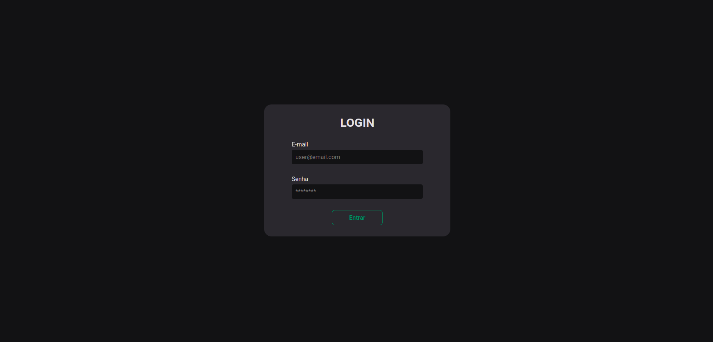

## Feed
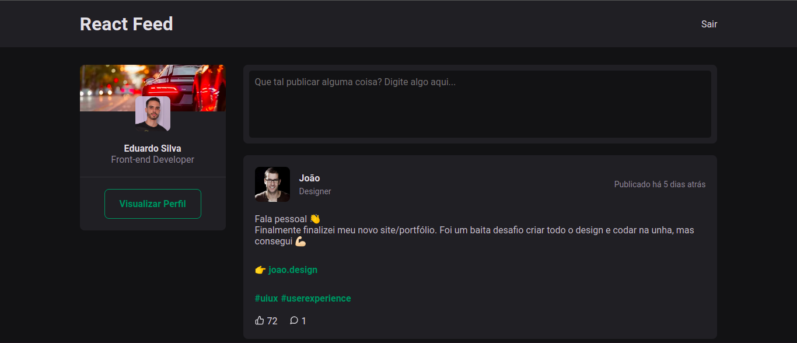

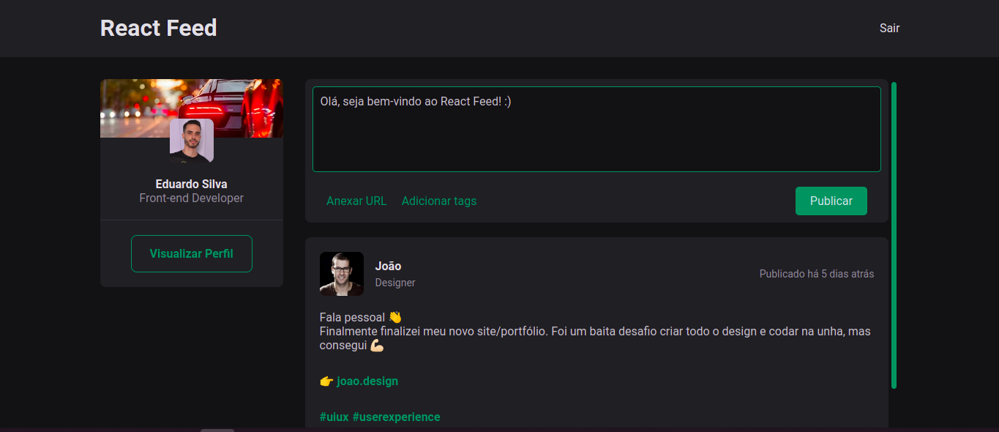

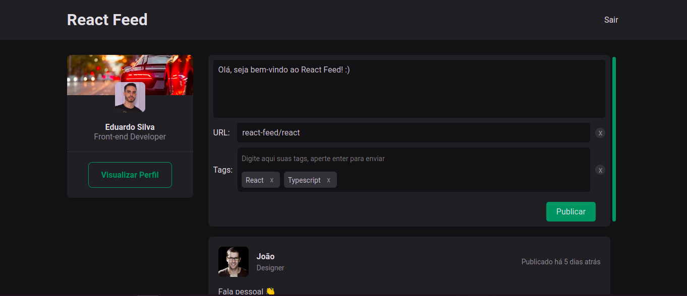

## Profile
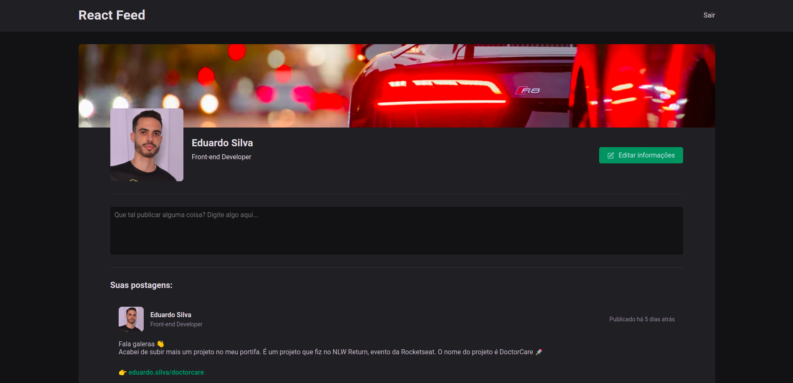

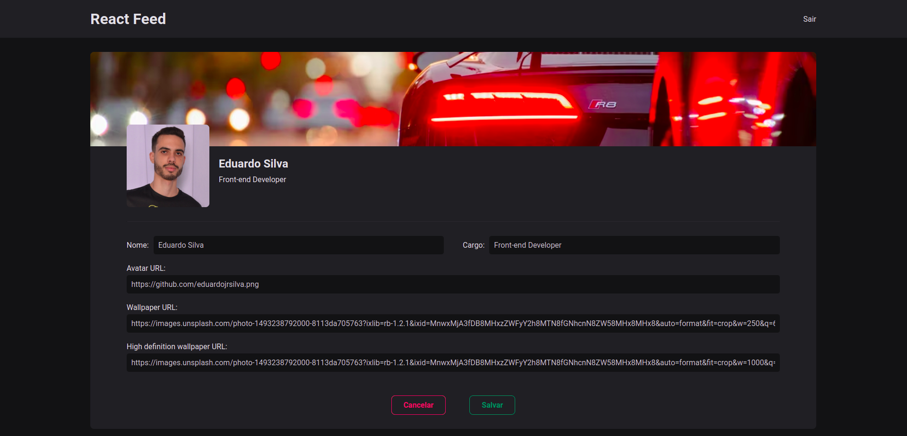

## Tags
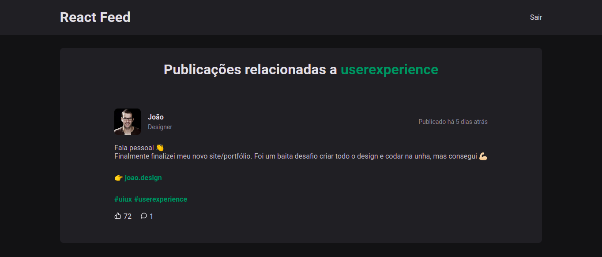

Além disso, a aplicação ainda conta com um layout responsivo. Segue abaixo as páginas em dispositivos móveis:

## Login Mobile
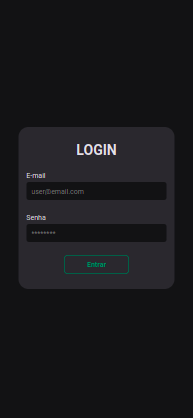

## Feed Mobile

  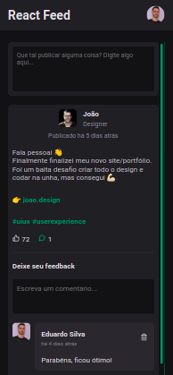

  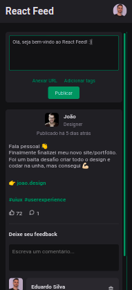

  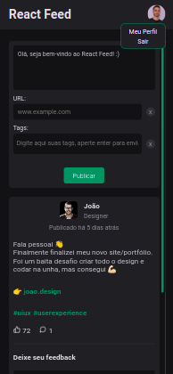

## Profile Mobile

  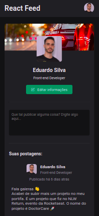

  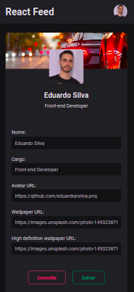

## Tags Mobile
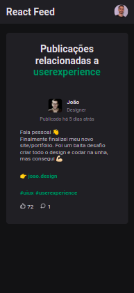