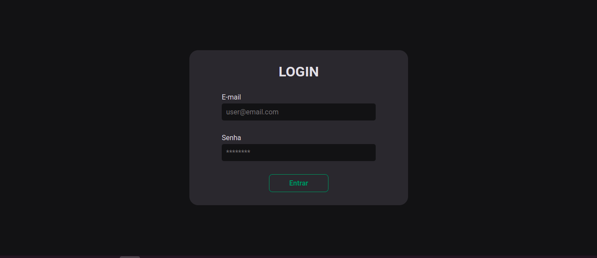

# React Feed

Este é um projeto desnvolvido em React baseado no design do projeto Ignite Feed, desenvolvido no Ignite 2022 da Rocketseat.

O React Feed conta com algumas adições, como uma página de perfil, página de publicações relacionadas a uma hashtag, e página de login.

Segue abaixo o resultado final:

## Login

## Feed

## Profile

## Tags
